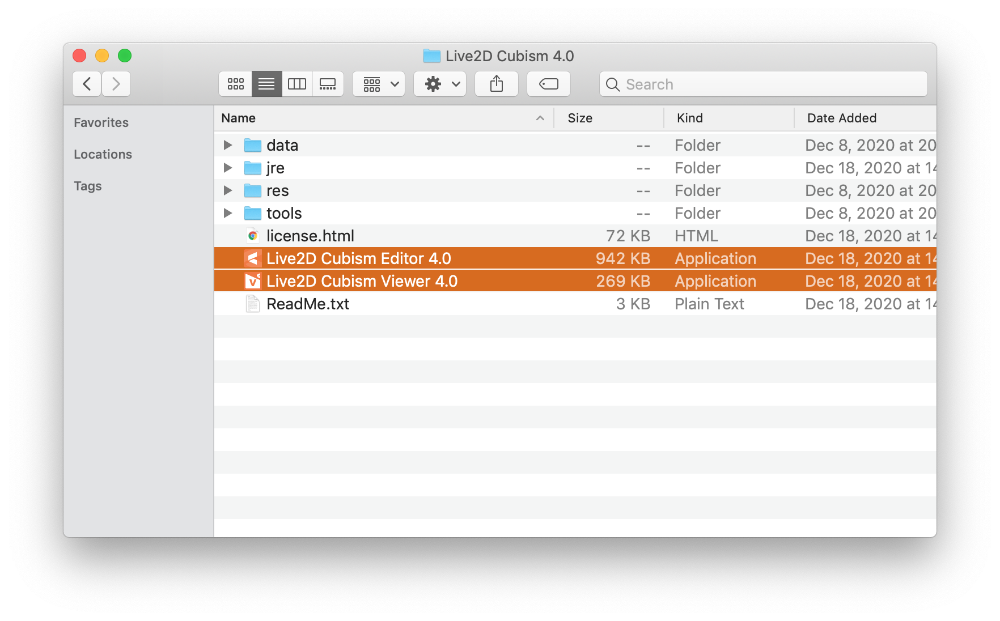

# App Won't Launch

Select both the **Live2D Cubism Editor 4.0** and the **Live2D Cubism Viewer 4.0** apps and launch them at the same time. The cause of the issue is unknown but may be related to some issues with Java as the Live2D Cubism apps are implemented in Java.

